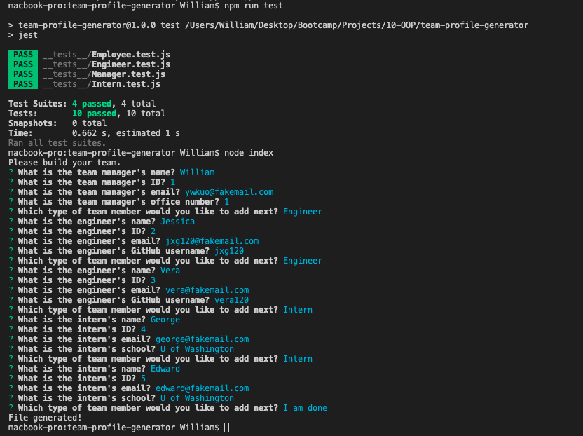

# Team Profile Generator

## Description
This is a Node.js command-line application that takes in information about employees on a software engineering team, then generates an HTML webpage that displays summaries for each person.

## Table of Contents
- [Installation](#installation)
- [Usage](#usage)

- [Contribute](#contribute)
- [Tests](#tests)
- [Questions](#questions)

## Installation
Once cloned/downloaded, open Integrated Terminal and install all dependencies using "npm i". To run the application, type in "node index".

## Usage
The application will prompt the users a series of questions (through command-line) depending on the role of the team member, it then generates a HTML file once the user is done answering the information of each team member.

## Links
Walkthrough Video: [Team Profile Gen Walkthrough](https://drive.google.com/file/d/1HtJUNkENrlCEiOuU0nfYwRqzCdQ0YMNX/view?usp=sharing)
Generated Sample HTML: [My Team](https://drive.google.com/file/d/1HtJUNkENrlCEiOuU0nfYwRqzCdQ0YMNX/view?usp=sharing)

## Contribute
If you wish to contribute, please feel free to contact me by email.

## Tests
The application package includes a unit test. To test the application, please enter "npm run test".

## Questions
GitHub: [ywkuo227's GitHub](https://github.com/ywkuo227)

Email: [ywkuo@outlook.com](mailto:ywkuo@outlook.com)